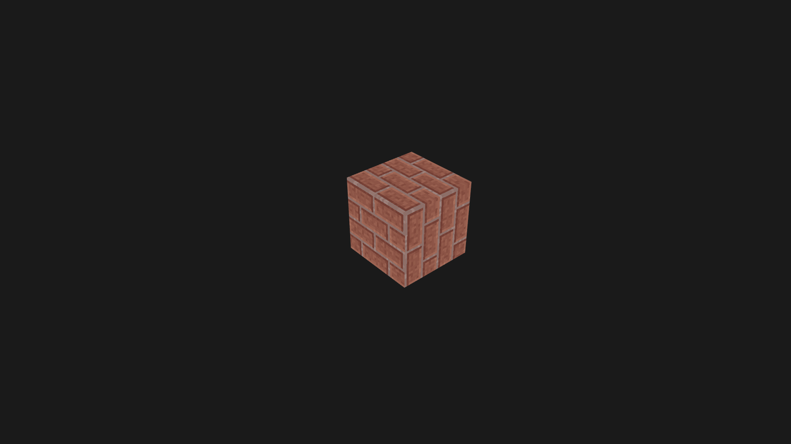

# Cube

 Voxel rendering engine (like Minecraft).  
 Written in C++ and OpenGL.  
 In progress...

### Features

 - [ ] World
   - [ ] Generation
     - [x] Flat terrain
     - [ ] Noise generated terrain
   - [ ] Biomes support
   - [ ] Structures
     - [ ] Grass 
     - [ ] Trees
 - [ ] Rendering
   - [x] Minecraft-like camera system
   - [ ] Mesh creation based on chunk data
   - [ ] Real-time rendering
     - [ ] Shadows
     - [ ] Lighting

### Controls

 WASD to move  
 Space/Left Shift to move up/down respectively  
 Use mouse to rotate camera  
 F1 to show debug information  

### Screenshot (0.3.1)

 You can see screenshots from older versions in `screenshots` directory  
 Below screenshot from latest build/version

 

### Dependencies

 - C++23 with STL
 - OpenGL 4.6
 - libPNG
 - Freetype
 - GLM
 - GLFW

### Useful links

 - [LearnOpenGL](https://learnopengl.com)

### Author
 Maks Makuta (c) 2025  

 Licensed content:
 - Source code - MIT License  
 - [Font](assets/fonts/nihonium113.ttf) - Open Font License   
 - [Textures](https://www.minecraftforum.net/forums/mapping-and-modding-java-edition/resource-packs/1243771-alvorias-sanity-1-12-2-no-longer-updating-sorry) - [CC BY-NC-SA 4.0](https://creativecommons.org/licenses/by-nc-sa/4.0/)
 